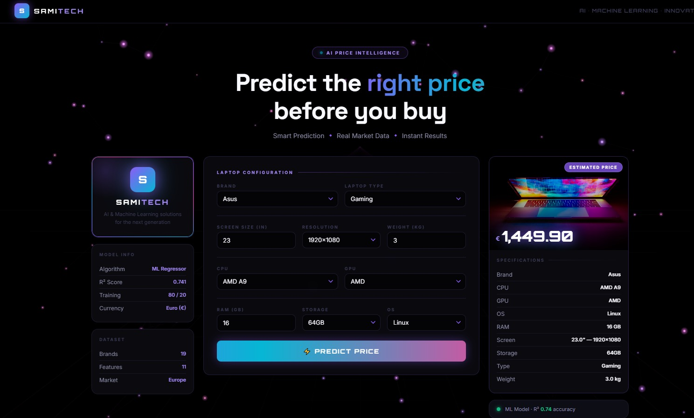

# Laptop Price Predictor

A full-stack Machine Learning web application that predicts laptop prices based on hardware specifications. The project combines a trained XGBoost regression model with a Flask backend and a responsive web interface, allowing users to estimate laptop prices instantly by selecting different hardware configurations.

The application demonstrates the complete machine learning deployment workflow, from data preprocessing and model training to API development and frontend integration.

---

## Overview

This project was developed to predict laptop prices using machine learning. Users provide laptop specifications such as brand, processor, RAM, storage, operating system, screen resolution, and weight through a web interface. The trained model processes these inputs and returns an estimated market price.

The backend is built with Flask and exposes a REST API that communicates with the frontend in real time.

---

## Features

- Machine learning-based laptop price prediction
- XGBoost regression model
- Flask REST API
- Responsive user interface
- Real-time prediction
- Automatic feature encoding
- Dynamic laptop information display
- Clean and modular project structure

---

## Technologies Used

### Machine Learning

- Python
- Pandas
- NumPy
- Scikit-learn
- XGBoost

### Backend

- Flask
- Pickle

### Frontend

- HTML5
- CSS3
- JavaScript

---

## Project Structure

```
Laptop-Price-Prediction/
│
├── app.py                     # Flask application
├── index.html                 # User interface
├── xgboost_model.pkl          # Trained machine learning model
├── laptop_Price.ipynb         # Data analysis and model development
├── requirements.txt
└── README.md
```

---

## Machine Learning Workflow

1. Data collection
2. Data preprocessing
3. Feature engineering
4. Categorical feature encoding
5. Model training
6. Model evaluation
7. Model serialization
8. Flask API development
9. Frontend integration

---

## Input Features

The model predicts laptop prices using the following features:

| Feature | Description |
|----------|-------------|
| Company | Laptop manufacturer |
| TypeName | Laptop category |
| Inches | Screen size |
| Screen Resolution | Display resolution |
| CPU | Processor type |
| RAM | Installed memory |
| Storage | Storage capacity |
| GPU | Graphics processor |
| Operating System | Installed operating system |
| Weight | Laptop weight |

---

## Model

The prediction model is built using the **XGBoost Regressor**, selected for its strong performance on structured tabular data.

After training, the model is saved as a Pickle file and loaded by the Flask application to generate predictions for incoming user requests.

---

## API

### Endpoint

```
POST /predict
```

### Example Request

```json
{
  "company": "Dell",
  "type_name": "Notebook",
  "inches": 15.6,
  "screen_res": "1920x1080",
  "cpu": "Intel Core i5",
  "ram": 8,
  "memory": "8GB",
  "gpu": "Intel",
  "op_sys": "Windows 10",
  "weight": 1.9
}
```

### Example Response

```json
{
  "price": 874.65,
  "image_url": "...",
  "specs": {
    "Brand": "Dell",
    "CPU": "Intel Core i5",
    "RAM": "8 GB",
    "Storage": "8GB",
    "GPU": "Intel"
  }
}
```


---
### Home Page

<p align="center">
  
</p


```
```
---

## Future Improvements

- Improve prediction accuracy through advanced feature engineering
- Hyperparameter optimization
- Support additional laptop specifications
- Containerize the application using Docker
- Cloud deployment
- User authentication
- Prediction history
- Model explainability using SHAP

---

## Author

**Sami Fahim**

Computer Science and Engineering Student

Machine Learning and AI Enthusiast


---

